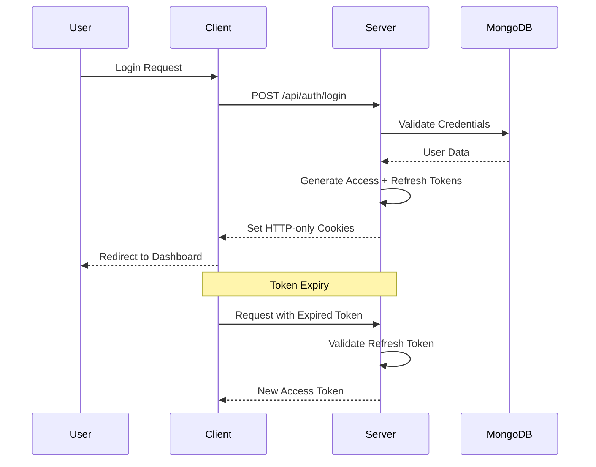

# 🎬 TMDB Movie Explorer

A production-ready full-stack movie exploration application built with **Next.js App Router**, **MongoDB**, and **Redux Toolkit**. Features enterprise-level authentication, favorites management, and role-based access control.


---

## 🌟 Key Features

### 🔐 Enterprise-Grade Authentication

- **JWT-based authentication** with access and refresh token rotation
- **HTTP-only cookies** for maximum security
- Token reuse detection and automatic revocation
- Protected routes with Next.js Middleware
- Role-based access control (User/Admin)
- Secure logout with token cleanup

### ❤️ Favorites Management

- Add and remove movies from your favorites list
- Real-time synchronization between frontend and backend
- Persistent storage for authenticated users
- Guest browsing without login required

### 🎥 TMDB Integration

- Browse extensive movie catalog from **The Movie Database (TMDB)**
- Genre resolution from IDs to human-readable names
- Server-side API proxy keeping your API key secure
- Optimized and cached API calls for better performance

### 🎨 Modern User Experience

- Clean, responsive UI built with Tailwind CSS
- Light/Dark theme toggle with persistence
- Smooth transitions and animations
- Mobile-first responsive design
- Centralized state management with Redux Toolkit

---

## 🛠️ Tech Stack

| Layer               | Technologies                                                   |
| ------------------- | -------------------------------------------------------------- |
| **Frontend**        | Next.js, React, Redux Toolkit, Tailwind CSS 
| **Backend**         | Next.js API Routes, MongoDB, Mongoose                          |
| **Authentication**  | JWT, HTTP-only Cookies, Token Rotation                         |
| **API Integration** | TMDB API v3                                                    |

---

## 📁 Project Structure

```
src/
├── app/
│   ├── api/                    # API route handlers
│   │   ├── auth/              # Authentication endpoints
│   │   ├── user/              # User management
│   │   ├── favourites/        # Favorites CRUD
│   │   └── genres/            # Genre data
│   ├── profile/               # User profile page
│   ├── admin/                 # Admin dashboard
│   └── layout.jsx             # Root layout
├── components/                 # React components
├── lib/                       # Utility functions
│   ├── db.js                  # MongoDB connection
│   ├── auth.js                # Auth utilities
│   └── tmdbFetch.js           # TMDB API wrapper
├── models/                    # Mongoose schemas
├── store/                     # Redux store
│   ├── slices/                # Redux slices
│   └── store.js               # Store configuration
└── middleware.js              # Next.js middleware
```

---

## 🚀 Getting Started

### Prerequisites

- Node.js 18+
- MongoDB database (local or cloud)
- TMDB API key ([Get one here](https://www.themoviedb.org/settings/api))

### Installation

1. **Clone the repository**

   ```bash
   git clone https://github.com/Shasatya/tmdb-movie-explorer.git
   cd tmdb-movie-explorer
   ```

2. **Install dependencies**

   ```bash
   npm install
   ```

3. **Configure environment variables**

   Create a `.env.local` file in the root directory:

   ```env
   MONGODB_URI=your_mongodb_connection_string
   JWT_SECRET=your_jwt_secret_key
   REFRESH_SECRET=your_refresh_token_secret
   TMDB_API_KEY=your_tmdb_api_key
   TMDB_API_URL=https://api.themoviedb.org/3
   ```

4. **Run the development server**

   ```bash
   npm run dev
   ```

5. **Open your browser**

   Navigate to [http://localhost:4000](http://localhost:4000)

---

## 🔑 Environment Variables

| Variable         | Description                      | Required |
| ---------------- | -------------------------------- | -------- |
| `MONGODB_URI`    | MongoDB connection string        | ✅       |
| `JWT_SECRET`     | Secret for access token signing  | ✅       |
| `REFRESH_SECRET` | Secret for refresh token signing | ✅       |
| `TMDB_API_KEY`   | Your TMDB API key                | ✅       |
| `TMDB_API_URL`   | TMDB API base URL                | ✅       |

---

## 🔐 Authentication Flow



**Key Security Features:**

- Access tokens expire quickly (15 minutes)
- Refresh tokens stored securely in database
- Token rotation on every refresh
- Automatic token reuse detection
- Secure logout with token revocation

---

## 🧪 API Endpoints

### Authentication

- `POST /api/auth/signup` - Register new user
- `POST /api/auth/login` - User login
- `POST /api/auth/logout` - User logout
- `POST /api/auth/refresh` - Refresh access token

### User

- `GET /api/user/profile` - Get user profile
- `PUT /api/user/profile` - Update profile

### Favorites

- `GET /api/favourites` - Get user favorites
- `POST /api/favourites` - Add to favorites
- `DELETE /api/favourites/:id` - Remove from favorites

### Movies

- `GET /api/genres` - Get movie genres
- TMDB proxy endpoints for movie data

---

## 🎯 Roadmap

- [ ] **Admin Dashboard** - User management and analytics
- [ ] **Advanced Filtering** - Genre, year, rating filters
- [ ] **Infinite Scroll** - Load more movies dynamically
- [ ] **Redis Caching** - Improve TMDB API performance
- [ ] **Rate Limiting** - Prevent API abuse
- [ ] **CSRF Protection** - Additional security layer
- [ ] **E2E Testing** - Playwright/Cypress integration
- [ ] **PWA Support** - Offline capabilities
- [ ] **Social Features** - Reviews and ratings

---

## 🤝 Contributing

Contributions are welcome! Please feel free to submit a Pull Request.

1. Fork the repository
2. Create your feature branch (`git checkout -b feature/AmazingFeature`)
3. Commit your changes (`git commit -m 'Add some AmazingFeature'`)
4. Push to the branch (`git push origin feature/AmazingFeature`)
5. Open a Pull Request

---

## 📝 License

This project is licensed under the MIT License - see the [LICENSE](LICENSE) file for details.

---

## 👨‍💻 Author

**Satyam Sharma**  
Full Stack Developer specializing in JavaScript, React, and Next.js

[](https://github.com/Shasatya)
[](https://linkedin.com/in/yourprofile)
[](https://yourportfolio.com)

---

## 🙏 Acknowledgments

- [TMDB](https://www.themoviedb.org/) for the amazing movie database API
- [Next.js](https://nextjs.org/) team for the excellent framework
- [Vercel](https://vercel.com/) for hosting solutions

---

## ⭐ Show Your Support

If you found this project helpful, please consider giving it a star! It helps others discover the project and motivates further development.

[](https://github.com/Shasatya/tmdb-movie-explorer)

---

**Note:** This project demonstrates production-level best practices including secure authentication patterns, proper secret management, and scalable architecture. It's designed as both a functional application and a learning resource for modern full-stack development.
